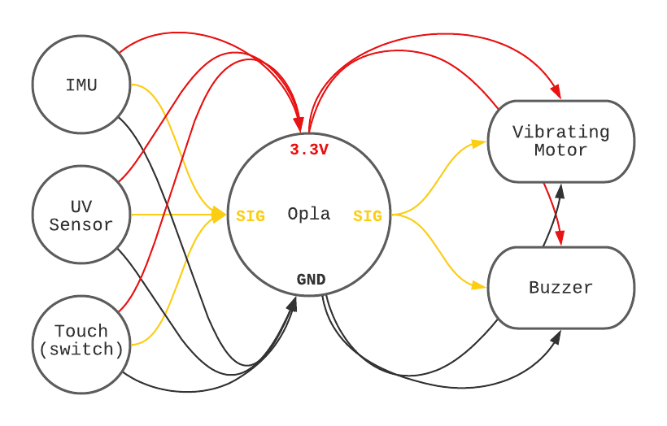

# Assignment 1: Wearable Project
> Wearable system for environmental sensing and feedback

> [PROMPT LINK](https://docs.google.com/document/d/1Xl1YSyWRIVDWvTWeaNu3gSM3fZbOMw0mk-BN9TmgWDI/edit?usp=sharing)

## Week 1

### **The Wearable "Sitting is Killing You" Charm**

This project is a wearable belt charm designed to tell people to stand up and move around once in a while, because sitting is killing you.

The device has a accelerometer detecting sitting to standing movements, which keeps track of the last time you stood up and moved your body around. If you've been sitting for too long, say, 2 hours in a row, it vibrates and buzzes like an alarm clock to remind you to stand up and get some exercise. Once you've done that, it quiets down, resets its timer, and waits for the next time it needs to buzz again.

### System Schematics

### Sketch

### Test - IMU & LED / Screen Feedback Device

https://user-images.githubusercontent.com/37056925/154743757-f4a42400-125d-4744-a43e-52d72bade187.mp4

https://user-images.githubusercontent.com/37056925/154743764-fa9acede-ac85-498e-b015-f871a4106215.mp4

