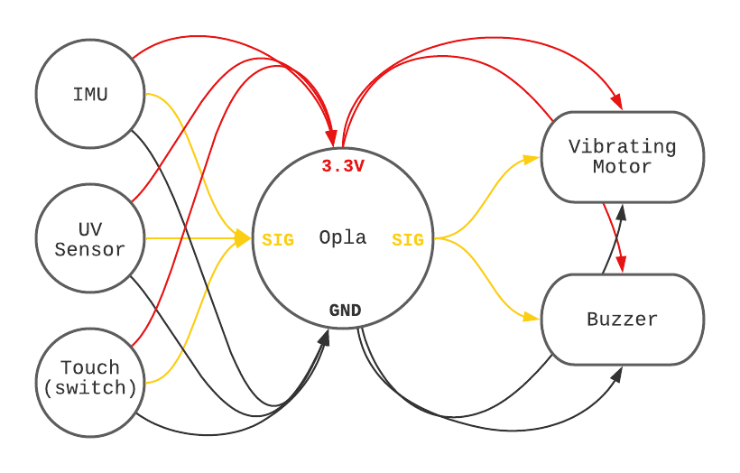
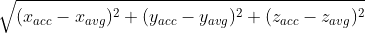
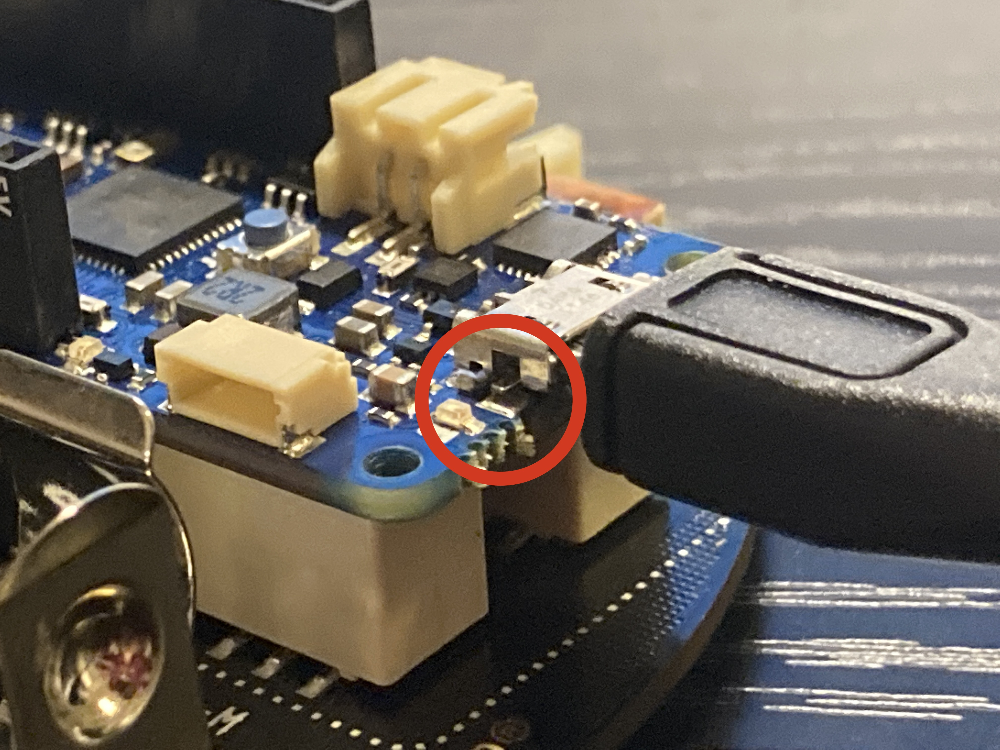
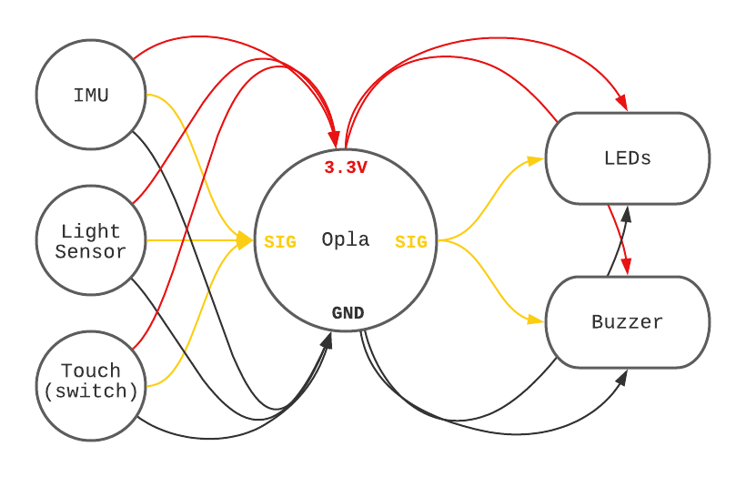

# Assignment 1: Wearable Project
> Wearable system for environmental sensing and feedback

> [PROMPT LINK](https://docs.google.com/document/d/1Xl1YSyWRIVDWvTWeaNu3gSM3fZbOMw0mk-BN9TmgWDI/edit?usp=sharing)

> #### **JUMP TO:**
> * [WEEK 1](#week-1)
> * [WEEK 2](#week-2)
> * [WEEK 3 & 4](#week-3--4)


## Week 1

> The goal of this week is two-folded. The technical goal is to set up your microcontroller prototyping environment. The design goal is to sketch out your wearable device (what type of garments, where will the sensors be placed?) 
> ...

### **The Wearable "Sitting is Killing You" Charm**

This project is a wearable belt charm designed to tell people to stand up and move around once in a while, because sitting is killing you.

The device has a accelerometer detecting sitting to standing movements, which keeps track of the last time you stood up and moved your body around. If you've been sitting for too long, say, 2 hours in a row, it vibrates and buzzes like an alarm clock to remind you to stand up and get some exercise. Once you've done that, it quiets down, resets its timer, and waits for the next time it needs to buzz again.


### System Schematics




### Sketch


### Test - IMU & LED / Screen Feedback Device


https://user-images.githubusercontent.com/37056925/154743757-f4a42400-125d-4744-a43e-52d72bade187.mp4


https://user-images.githubusercontent.com/37056925/154743764-fa9acede-ac85-498e-b015-f871a4106215.mp4


<br>

## Week 2

> Time to start sewing. Let’s start with a step counter and a smidge of feedback. You will sew the devices into your wearable ecosystem, and record a video of you using the step counter.  Describe and demonstrate the feedback loop in the video.  Remember, this is an additive project, so make sure that you put this together such that everything else can be easily integrated.


### Function demo of step counter

> * Your screen should function as: once a step is detected, the screen displays the total number of steps. For example, when you just start to wear the device, the screen should display “0 steps”. Once you make a step, the screen should display “1 step”. 
> * There are five LEDs on the Opla. These LEDs should function as, when you turn left, the LEDs on the left side should blink. When you turn right, the LEDs on the right side should blink. 
> * Integrate another type of feedback device. 

#### **Functionality Check**

https://user-images.githubusercontent.com/37056925/156268892-28ebf381-d111-47fb-926b-ab48d4354b69.mp4

#### **Wearable Demo**

https://user-images.githubusercontent.com/37056925/156490803-7ceb8389-a8a3-4c5e-ae3b-e824b7122428.mp4


### A screen recording of the steps being counted on the Arduino serial monitor


https://user-images.githubusercontent.com/37056925/156268877-6811ac54-b0d0-4c50-80ca-f1c0078f6104.mp4


### Arduino code

Arduino code is uploaded to [this directory](./simple_step_counter/).


### A short write up

#### **Accelerometer >>> Steps**

This simple step counter collects data from the accelerometer and gyroscope in its IMU. In setup, a calibration method is called to calibrate the board according to its current position. The `calibrate()` method reads in 100 samples of acceleration data and stores a average value for each axis, which would serve as a reference to 'idle state' of board movements. Then, in each loop, the program reads in accelerometer values of the X, Y and Z-axis.

After getting the 3-axis values, calculate the total **acceleration vector** by taking the square root of the sum of X, Y, and Z-axis's squared value minus the axis's average value. 



This acceleration vector reflects the board's movement. When the board movement is idle, the vector's value is below 0.1, thus I set the threshold of step detection to be **0.1**. Whenever the vector value is above 0.1, a step is detected and the total step count is incremented by 1.

#### **Gyroscope >>> Turning**

Gyroscope data is used to detect turning. With some testing, I found out that the Y-axis value from the gyroscope reflects turning movements horizontal to the ground. *(This is due to the fact that the Oplà board is held up vertical to the ground in this design.)* Thus, the Y-axis value is used to detect turning. The threshold value in this case is set to **100** and **-100** in this case.

When a *RIGHT* turn is detected, the LED on the right blinks, and the board buzzer plays the melody "DO RE MI". Similarly when a *LEFT* turn is detected, the LED on the left blinks and the board buzzer plays a "MI RE DO" melody. The notes are specified in the `pitches.h` header file.

<br>

### A little accident

<!--  -->


While building the wearable prototype onto a belt, I accidentally dropped the board. It hit the floor and then became not responsive to power supply. After a quick check I found out that the metal pin connecting the micro-usb port to the board got disconnected, as shown in the red circle, and that when they are pinched back together the power supply went through again.

https://user-images.githubusercontent.com/37056925/156286384-a9062bc6-1bc2-46af-9b7b-4e01dfddda8e.mp4


I'll need to find out what's the best way to fix this without (further) hurting the board.


<br>

## Week 3 & 4

### Video documentations

#### **Testing light/dark mode controlled byambient light sensor**

https://user-images.githubusercontent.com/37056925/156705747-56f23339-ec4d-488f-86bb-2f1ca8d72d23.mp4


#### **Functional Demo**

https://user-images.githubusercontent.com/37056925/156705759-9145530c-cee0-4f00-b340-3dd8da480818.mp4

<br>

### Collected Data

Collected serial [accelerometer data](./sitting_is_killing_you/sitting_alarm_data.csv) with pyserial library.

<br>

### Arduino Code

Arduino code updated in [this directory](./sitting_is_killing_you/).

<br>

### Written Report

As stated before, this project is a wearable belt charm designed to tell people to stand up and move around once in a while, because sitting is killing you. The final product came out as a "wearable" alarm that reads in body movements and environment light ambient, and uses light + sound as the feedback media.

<br>

#### **_Design Update_**



I made a few updates to the original design of the device. A major update would be changing the vibrating motor to LED lights. This is mainly because I want the device to have a "silent alarm" that would be more compatible with a newly added "dark mode" design. Judging from real life experiences, when you're working alone at night in a quite environment, a sudden alarm sound can be quite scary. We don't want the users to have any near-heart attack experiences, so a silent alarm had to be in place.

The light sensor would read in ambient light to determin if the user is in a dark or bright environment. When it's bright, the feedback media is the usual light + sound combination. When it's dark, dark mode is automatically activated, and we use light as the only feedback medium. 

If the user has a certain perferred mode, they could also turn off the auto mode-switching function through the upper-left touch button, and manually switch modes through the upper-right touch button.

Alarms in different modes are demonstrated in the videos above.

<br>

#### **_Hardware_**

Hardware-wise, I used the Arduino Oplà board as the minicontroller. The built-in IMU, light sensor and touch sensors in its IoT carrier saved a lot of wiring hazzle in the hardware process.

Something worth noticing is that this project gave me a clearer idea of the importance to calibrate positional sensors when the device is activated. This helps positional sensors to read in data that are consistent with the thresholds set in the program.

<br>

#### **_Software_**

_Code Structure_

The system's program works around the alternation of a few key flag variables: 

* `should_move` - if the user's "sitting timer" is up
* `is_moving` - if the user is currently moving (accelerometer data)
* `dark_mode` - if the dark mode is on

The code structure is organized as the following:

```arduino
void setup() {
    /*
     * Set up serial;
     * Set up carrier;
     * Initialize carrier display;
     * Calibrate accelerometer;
     * Initialize timer & flags;
     * ...
     */
}


void loop() {
    // Update step and turning detection
    get_accl_update();
    get_timer_update();
    get_light_update();  

    ...
    
    // Update feedbacks
    if (should_move && !is_moving){
        /*
        * Change display text;
        * Trigger light alarm;
        * If is not dark mode -> trigger sound;
        * ...
        */
    } else {
        ...
    }
    ...
}
```

_Accelerometer >>> Movement_

Similar to the step counter, I used the accelerometer to caputure movements from the user, in order to determine whether the user is sitting or standing. 

**Movement** in this case is still numerialized by calculating the magical **acceleration vector** by taking the square root of the sum of X, Y, and Z-axis's squared value minus the axis's average value. 


Although, I did fix a bug from previous checkpoints in the computation process, that led to much more reasonable vector value ranges. After the bug fix, the final threshold of movement detection is set t be **1.0**.

<br>

#### **_Challenges & Limitations_**

The system still faces many challenges and limitations. One thing that stands out to me is that the device would benefit from a more complex control logic.

First, the alarm timer is currently hard-coded in the program. It would make more sense if the user could set the timer interval through on-broard operations. 

Secondly, while making standing up the only way the alarm could be turned off is a design decision, I still have doubts on whether having a general ON/OFF button to the entire system would increase its usability or weaken the alarming effect. These are all limitations that could be addressed if this device is taken into further iterations.  

<br>

### References

* Acceleration detection code used in this project is inspired by [this blog post](https://circuitdigest.com/microcontroller-projects/diy-arduino-pedometer-counting-steps-using-arduino-and-accelerometer) by Ashish Choudhary.
